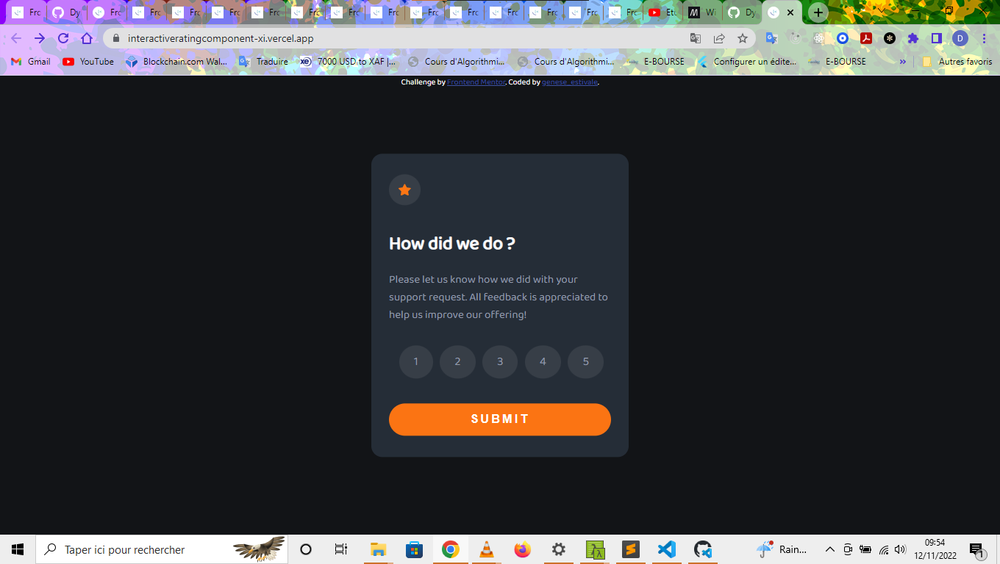

# Frontend Mentor - Interactive rating component solution

This is a solution to the [Interactive rating component challenge on Frontend Mentor](https://www.frontendmentor.io/challenges/interactive-rating-component-koxpeBUmI). Frontend Mentor challenges help you improve your coding skills by building realistic projects.

## Table of contents

- [Frontend Mentor - Interactive rating component solution](#frontend-mentor---interactive-rating-component-solution)
  - [Table of contents](#table-of-contents)
  - [Overview](#overview)
    - [The challenge](#the-challenge)
    - [Screenshot](#screenshot)
  - [My process](#my-process)
    - [Built with](#built-with)
    - [Continued development](#continued-development)
  - [Author](#author)

**Note: Delete this note and update the table of contents based on what sections you keep.**

## Overview

### The challenge

Users should be able to:

- View the optimal layout for the app depending on their device's screen size
- See hover states for all interactive elements on the page
- Select and submit a number rating
- See the "Thank you" card state after submitting a rating

### Screenshot

## My process

### Built with

- Semantic HTML5 markup
- CSS custom properties
- Javascript ES6
- Flexbox
- Mobile-first workflow

### Continued development

Then I would like to deepen the mastery of flexboxes and css grids.

## Author

- Frontend Mentor - [@yourusername](https://www.frontendmentor.io/profile/Dylan245-droid)
- Twitter - [@yourusername](https://www.twitter.com/ondo_dylan)
